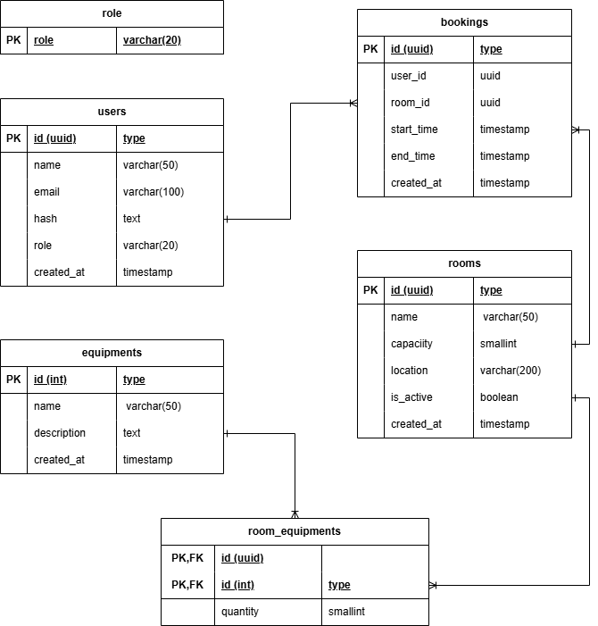
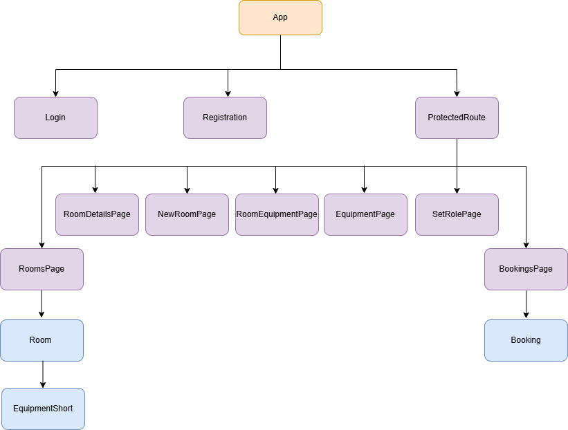

# 🐝 RoomHive — Room Booking App (PERN)

RoomHive is a full-stack room booking application where users can browse rooms, create bookings, and manage their upcoming/past reservations. Admins can manage rooms and equipment, and control user roles.

## ✨ Features

- Authentication with JWT access/refresh tokens
- Browse rooms and view room details (capacity, location, equipment)
- Create bookings with time range validation and clash prevention
- View upcoming bookings by default, with an option to view past bookings
- Admin-only capabilities:
  - Create/update/delete rooms
  - Create/update/delete equipment
  - Assign equipment + quantities to rooms
  - Set user roles (User/Admin)

## 🧰 Tech Stack

- Frontend: React (Vite), React Router, Tailwind CSS (CDN)
- Backend: Node.js, Express
- Database: PostgreSQL
- Auth/Security: JWT, bcrypt, Helmet, express-rate-limit, CORS

## 🗄️ Database Schema



## 🧩 React Component Tree



## ⚙️ Environment Configuration

This repo uses two environment files:

- Backend: `backendExpress/.env`
- Frontend: `frontendApp/.env`

### 🖥️ Backend (`backendExpress/.env`)

Create `backendExpress/.env` with values like:

```dotenv
DB_HOST=localhost
DB_PORT=5432
DATABASE=room_book_system
DB_USERNAME=db_user
DB_PASSWORD=your_password

# API port
BACKEND_PORT=5003

# Long random secrets for signing JWTs
ACCESS_SECRET=your_long_random_access_secret
REFRESH_SECRET=your_long_random_refresh_secret
```

### 🌐 Frontend (`frontendApp/.env`)

Create `frontendApp/.env` with:

```dotenv
VITE_SERVER=http://localhost:5003
```

## 🚀 Setup & Run

### 1) 🐘 Database setup (PostgreSQL)

- Create a database (example name: `room_book_system`).
- Ensure UUID generation is available:
  - In psql: `CREATE EXTENSION IF NOT EXISTS "uuid-ossp";`
- Run the schema SQL in `backendExpress/create.sql`.

### 2) ▶️ Start the backend

```bash
cd backendExpress
npm install
npm run dev
```

Backend runs on `http://localhost:5003` when `BACKEND_PORT=5003`.

### 3) ▶️ Start the frontend

```bash
cd frontendApp
npm install
npm run dev
```

Open the Vite dev URL shown in the terminal (typically `http://localhost:5173`).

## 🗂️ Project Structure

- `backendExpress/`
  - `server.js`: Express app bootstrap
  - `controllers/`, `routers/`: API logic and routes
  - `db/db.js`: database connector
  - `middleware/auth.js`: route protection (JWT)
- `frontendApp/`
  - `src/components/`: pages + shared UI components
  - `src/context/user.jsx`: auth state management
  - `src/shared/sharedFetch.jsx`: fetch wrapper with token refresh retry

## 🧠 Project Takeaways

- Booking systems live or die by correct time logic: validating ranges, preventing overlaps, and handling time zones consistently.
- Backend API design matters: clean endpoints (including “who am I” user hydration) and consistent error handling make the frontend dramatically simpler.

## 📝 Additional Notes

- Styling uses Tailwind via CDN (no Tailwind install step).
- If you change the backend port, update `frontendApp/.env` (`VITE_SERVER`) to match.
